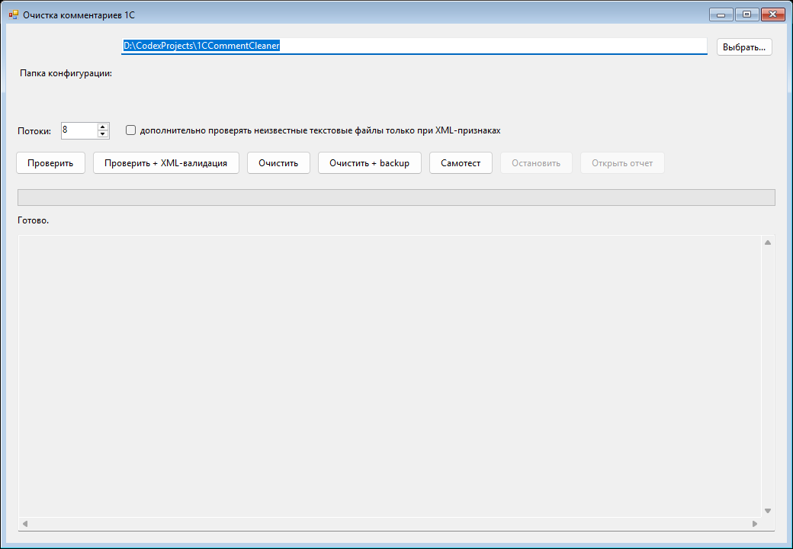
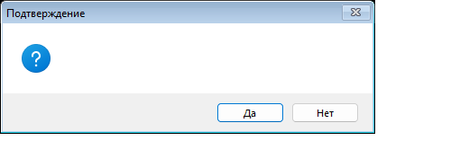
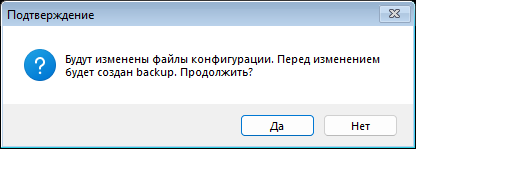

# 1CCommentCleaner

Переносимый обезличиватель комментариев для XML-выгрузки конфигурации 1С.

Программа очищает XML-комментарии и поля комментариев в XML-файлах, а в BSL-модулях заменяет найденные комментарии на `// ЗАГЛУШКА`. За счет такой замены количество строк в модуле после обработки остается таким же, как до обработки.

## Что внутри

- `Clean1CCommentsGui.exe` - GUI-приложение для обычной работы.
- `Run_GUI.cmd` - запуск GUI из папки программы.
- `clean_1c_comments.py` - консольный вариант очистителя.
- `python\python.exe` - локальный Python, не нужен Python в `PATH`.
- `Reports\` - локальная папка отчетов.
- `Check_Selected_Folder.cmd` - dry-run без изменений.
- `Check_Selected_Folder_With_XML_Validation.cmd` - dry-run с XML-валидацией.
- `Apply_Selected_Folder_With_Backup.cmd` - применение очистки с backup.
- `Python_SelfTest.cmd` - проверка Python-скрипта.

## Быстрый старт через GUI

1. Выгрузите конфигурацию 1С в XML-файлы.
2. Откройте `Run_GUI.cmd` или запустите `Clean1CCommentsGui.exe`.
3. В поле `Папка конфигурации` выберите папку XML-выгрузки.
4. Нажмите `Проверить + XML-валидация`.
5. Если ошибок нет, нажмите `Очистить + backup`.
6. После обработки загрузите очищенную конфигурацию в пустую базу 1С и проверьте, что она загружается без ошибок.

## Главное окно

После запуска откроется окно очистителя. В верхней строке указывается папка выгрузки, ниже находятся настройки потоков и кнопки действий.



Основные кнопки:

- `Проверить` - анализирует файлы и показывает, что будет изменено, но ничего не перезаписывает.
- `Проверить + XML-валидация` - безопасный рекомендуемый первый запуск. Дополнительно проверяет изменяемые XML-файлы на корректность.
- `Очистить` - сразу изменяет файлы без автоматического backup.
- `Очистить + backup` - изменяет файлы и перед этим сохраняет копии исходных файлов.
- `Самотест` - проверяет встроенные сценарии обработки.
- `Остановить` - прерывает текущую операцию.
- `Открыть отчет` - открывает последний созданный JSON-отчет.

## Рекомендуемый сценарий

### 1. Выберите папку

Нажмите `Выбрать...` и укажите папку XML-выгрузки конфигурации 1С. Это должна быть именно папка с файлами выгрузки, а не информационная база.

### 2. Сначала выполните проверку

Нажмите `Проверить + XML-валидация`. На этом шаге программа не меняет файлы, а только считает будущие изменения и пишет отчет.

В логе внизу окна будут показаны режим, папка, количество потоков, сколько файлов найдено и сколько комментариев будет обработано.

### 3. Примените очистку с backup

Если проверка прошла без ошибок, нажмите `Очистить + backup`. Перед изменением файлов появится подтверждение.



Нажимайте `Да`, только если выбрана правильная папка выгрузки. Backup создается рядом с исходной папкой, имя будет похоже на:

```text
ИмяПапки_backup_comments_YYYYMMDD_HHMMSS
```

### 4. Откройте отчет

После завершения нажмите `Открыть отчет`. В отчете можно посмотреть общий итог и список файлов, в которых были изменения.

Все новые отчеты GUI пишет в каталог:

```text
1CCommentCleaner\Reports
```

### 5. Проверьте результат в 1С

После очистки загрузите XML-выгрузку в пустую базу 1С. Это финальная проверка, что обезличенная конфигурация остается рабочей.

## Самотест

Кнопка `Самотест` запускает встроенную проверку логики обработки. Она не меняет вашу конфигурацию.



Самотест проверяет, что:

- комментарии BSL заменяются на `// ЗАГЛУШКА`;
- количество строк BSL-модуля не меняется;
- `//` внутри строк и URL не повреждаются;
- XML-комментарии и поля комментариев очищаются корректно;
- BOM в UTF-8 XML сохраняется.

## Настройки

`Потоки` задает количество параллельных обработчиков. Обычно значение по умолчанию менять не нужно.

Флажок `дополнительно проверять неизвестные текстовые файлы только при XML-признаках` нужен для осторожного расширенного режима. В обычном сценарии его можно оставить выключенным.

## Консольный запуск

Dry-run:

```bat
Check_Selected_Folder.cmd "D:\Path\To\ConfigDump"
```

Dry-run с XML-валидацией:

```bat
Check_Selected_Folder_With_XML_Validation.cmd "D:\Path\To\ConfigDump"
```

Применить очистку с backup:

```bat
Apply_Selected_Folder_With_Backup.cmd "D:\Path\To\ConfigDump"
```

Все `.cmd` запускают именно локальный:

```text
1CCommentCleaner\python\python.exe
```

и не используют Python из `PATH`.